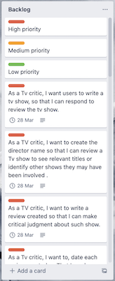
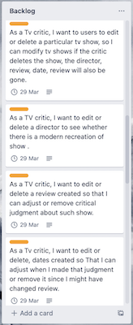
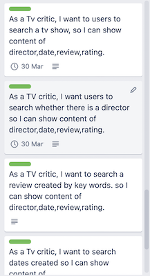
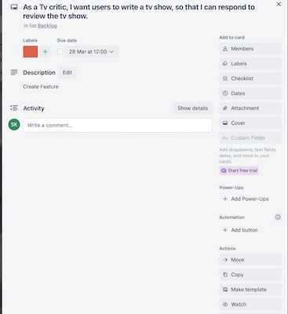

# TV show review application

# Link to source control repository 

[Source control] https://github.com/sulemankhayre/sulemankhayre_TIA3/tree/main/src

#  Review  app

I inteded to create this app because i love tv shows, i created a journal for myself and others to highlight my opinions. I thought this because, i l’d like to have a stream of thoughts and opinions about things I love.

# Code style 

using RuboCop Ruby code style checker (linter) and formatter based on the community-driven Ruby Style Guide and following ruby conventions.

Code follows OOP and has division of classes and modules

All lines of methods operate on the same level of abstraction.

Avoiding long methods.

Avoiding long parameters

TDD Testing implemented

Write and Read Files safetly 

Avoid Termination with Error handling implemented

# List of features

Users are able to create reviews

Users are able to edit/delete reviews.

Users can  search reviews

# Implementation Plan

## Tshirt system 

### Trello

[Link to trello] 
https://trello.com/b/FGQLPfuH/sulemankhayretia1board

## Help documentation

### Steps to install the application

To run the app you will need to be in the src folder and run the script ./run_app.sh . This will install the gem dependencies with bundle install and run the main program (tv.rb). It works through terminal command line interface.

### any dependencies required by the application to operate

4 gems are used throughout. 

  RubyFiglet::Figlet : for asci headings

  Rspec testing ~ Using rspec 3.11.0

  highline "~> 2.0": for colouring text ~

  Using tty-prompt 0.23.1 : for inputs
 
 ### any system/hardware requirements

 Compatiable with all hadware and software that have bash 
 #!bash/bin basically all unix/linux os are quite opperatable
 with it.

 A terminal is required.

### how to use any command line arguments made for the application
Run inside the src folder ruby tv.rb   with the argumented values below.
so  in essence an example would be ruby tv.rb --a or ruby tv.rb  --g

'--h', '--help'

Below displayed are the commands to find what the project is about and gems used
'--g', '--gems'

'--a', '--about'

# referenced sources 

https://ruby-style-guide.shopify.dev

